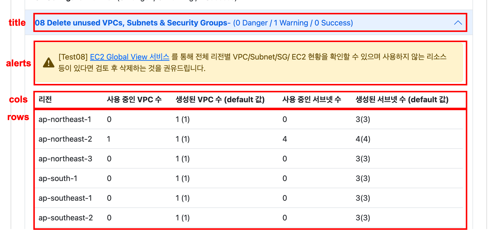

# ssb

ssb는 총 3개의 python 파일로 되어 있으며 각 역할은 아래와 같습니다.

1. [ssb](#ssb-1): 관련된 AWS API를 호출하여 AWS SSB의 항목을 진단합니다. 총 10가지의 테스트를 진행하며, 비동기적으로 테스트를 실행합니다.
2. [report](#report): 위 진단의 결과를 바탕으로 html 형식의 리포트를 생성합니다.
3. [text](#text): 각 테스트 별 결과에 따른 문구가 python dictionay 형식으로 저장되어 있습니다.

## [ssb](#)

lambda 함수에서 ssb의 checks 함수를 호출하여 총 10개의 테스트를 비동기적으로 실행하여 아래와 같은 형식으로 결과를 반환합니다. 

테스트 결과는 아래와 같이 alerts과 table에 추가합니다. ret에 추가된 내용은 최종적으로 리포트에 아래 이미지와 같이 반영됩니다.


```python
ret = {
    "title": "08 Delete unused VPCs, Subnets & Security Groups",
    "alerts":[],
    "tables": [
        {
            "cols": ["리전", "사용 중인 VPC 수", "생성된 VPC 수 (default 값)", "사용 중인 서브넷 수", "생성된 서브넷 수 (default 값)"],
            "rows": []
        }
    ]
}

# alerts에 항목 추가
ret["alerts"].append({
        "level": text.test8["Warning"]["level"],
        "msg": text.test8["Warning"]["msg"],
        "title": text.test8["title"]
    })

# rows에 항목 추가
append_table(ret, 0, row)

```



그 외의 세부적인 진단 기준은 각 테스트 항목의 주석을 확인 바랍니다.

## [report](#)

ssb 함수에서 반환된 결과값을 `report.py`에 정의된 템플릿을 이용하여 html 형식의 리포트를 생성합니다.

리포트는 [bootstrap](https://getbootstrap.com/)을 활용하여 제작되었습니다. 버전 문제가 발생할 경우, `header`와 `footer`를 모두 수정해주시기 바랍니다.


## [text](#)

`text.py`에서는 테스트마다 아래와 같은 형식으로 테스트 결과(Success, Warning, Danger, Error, Info)에 따른 문구를 하이퍼링크 url과 함께 지정할 수 있습니다.

msg 항목에서는 Details에 기록되는 내용을 지정할 수 있습니다. 아래와 같이 msg 항목을 구성할 경우, "[Details](#text) 에 기록되는 내용"처럼 변환됩니다.

```python
testNum = {
    "title": "리포트 summary에 표기되는 내용",

    "resultName": {
        "level": "Success"|"Warning"|"Danger"|"Error"|"Info",
        
        "msg": [
                {
                    "text": "Details", 
                    "link": URL
                },
                {
                    "text": "에 기록되는 내용", 
                    "link": ""
                },
            ]
    }
}
```